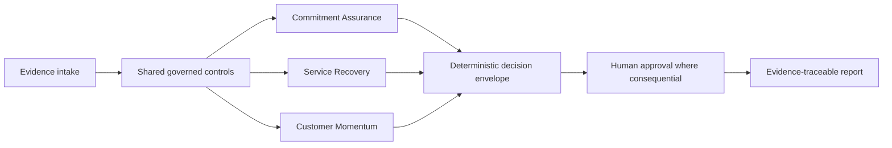

# VANTIX Attestor

Customer teams cannot safely close commitments, recover services, or intervene on deteriorating accounts when evidence, decision authority, and measured outcomes are not bound into one governed process.

> **Portfolio Preview v0.1 — synthetic evidence only.** No production-scale, live Salesforce, live model-provider, or real-customer outcome claim is made.

## Architecture at a glance

## Three validated results

| Result | Evidence |
|---|---|
| Commitment Assurance completed one owner-run synthetic n8n path with all 20 nodes green. | [`evidence/screenshots/commitment-assurance-green.png`](evidence/screenshots/commitment-assurance-green.png) |
| Service Recovery completed one owner-run synthetic n8n path with all 20 nodes green. | [`evidence/screenshots/service-recovery-green.png`](evidence/screenshots/service-recovery-green.png) |
| Customer Momentum completed one owner-run synthetic n8n path with all 24 nodes green. | [`evidence/screenshots/customer-momentum-green.png`](evidence/screenshots/customer-momentum-green.png) |

## Failure found and fixed

The Service Recovery pre-import review found unsafe reliance on evidence array order plus incomplete timestamp, approval-binding, AI-reference, contradiction, recurrence, and decision-envelope checks. The corrected v0.2 workflow was then imported and executed successfully. See [`docs/defect-register.md`](docs/defect-register.md).

## Limitation

Only one positive synthetic execution path per primary module is evidenced. Adversarial security tests, negative-path execution evidence, production-scale testing, live integrations, and a recorded 60–90 second demo remain open.

## Demo and evidence

- **60–90 second demo:** pending recording; see [`docs/demo-script.md`](docs/demo-script.md).
- **Full evidence index:** [`docs/evidence-index.md`](docs/evidence-index.md)
- **Executive brief:** [`docs/executive-brief.md`](docs/executive-brief.md)
- **Quality scorecard:** [`docs/quality-scorecard.md`](docs/quality-scorecard.md)

## Modules

| Module | Decision | Treatment |
|---|---|---|
| Commitment Assurance | Was the promised outcome fulfilled and authorised for closure? | Tier A target; current evidence remains Portfolio Preview depth. |
| Service Recovery | Has the service recovered, and has customer confidence recovered? | Tier B supporting module. |
| Customer Momentum | What changed, what hypothesis is supported, and did the approved intervention improve the outcome? | Tier B supporting module. |

## Repository map

- `workflows/` — sanitized, inactive n8n workflow exports
- `evidence/` — owner-run synthetic execution screenshots and generated reports
- `docs/` — decision-oriented documentation, governance, measurement and traceability
- `validation/` — structural validation, wording scan and integrity results
- `standards/` — governing documentation standard

## Release position

This repository is labelled **Portfolio Preview**, not production readiness, Verified Release, or externally certified. Final tier advancement is blocked until the open gates in [`docs/final-signoff-gates.md`](docs/final-signoff-gates.md) are closed.
