# VANTIX Control Value

**Customer Commitment Assurance**

> **Business outcome:** Prevents customer commitments from being marked complete merely because work occurred; closure requires evidence of the promised outcome, deterministic policy eligibility, and human-authorised closure.

> **Portfolio Preview — synthetic evidence with preserved owner-run n8n evidence.** No production-scale, live Salesforce, live Gemini, authenticated production approval, or real-customer outcome claim is made.

[Executive Brief](docs/EXECUTIVE_BRIEF.md) · [Evidence Index](docs/EVIDENCE_INDEX.md) · [Quality Scorecard](docs/QUALITY_SCORECARD.md) · [Lineage](docs/RELEASE_LINEAGE.md)

## Recruiter-simple front door

### What it decides

Control Value answers six questions:

1. What was promised?
2. What outcome was expected?
3. What intervention was permitted?
4. What actually happened?
5. What technical and customer evidence verifies the outcome?
6. If the outcome is not verified, must it retry, reroute, escalate, or remain open?

### Architecture

```mermaid
flowchart LR
    P[Promise + expected outcome] --> V[Deterministic intake validation]
    V --> D[Duplicate / replay protection]
    D --> R[Deterministic assessment]
    R --> E[Evidence observation]
    E --> A[Bounded AI diagnosis replay]
    A --> C[Independent critique replay]
    C --> G[Deterministic AI-output validation]
    G --> Y[Action-catalogue policy]
    Y --> H[Human-approval contract]
    H --> X[Permitted synthetic action]
    X --> T[Technical verification]
    T --> U[Customer-use verification]
    U --> S[SLA + outcome determination]
    S --> Z[Retry / reroute / escalate / close]
    Z --> Q[Complete-run validation]
    Q --> O[Executive evidence report]
```

### Three evidence-backed results

- The retained Gate 2 workflow contains **20 nodes** and implements the governed promise-to-outcome chain above.
- The later stored validation snapshot inspected on 7 August records **103 passed / 0 failed** for Foundation and **103 passed / 0 failed** for Gate 2. These are stored-report results, not a fresh independent rerun by this remediation.
- Retained repository evidence inventories identify an owner-run Control Value n8n executive report dated **5 August 2026**. That synthetic execution must not be represented as live Salesforce, Gemini, customer, or authenticated-human evidence.

### Real failure-and-fix history

Prior Project 3 records state that two separate test suites passed and **three real defects were fixed with permanent regression tests**. This remediation preserves that bounded statement and does not invent new defect counts or percentages.

### Decision rights

| Decision | Authority |
|---|---|
| Canonical intake validity | Deterministic code |
| Duplicate / replay handling | Deterministic code |
| Likelihood / impact / priority / confidence | Deterministic code |
| Evidence facts | Evidence records + deterministic validation |
| Diagnosis / explanation | Bounded AI fixture at Gate 2 |
| Critique | Separate bounded AI fixture at Gate 2 |
| AI-output validity | Deterministic code |
| Permitted action catalogue | Deterministic policy |
| Consequential action / closure approval | Human-approval contract; Gate 2 evidence is a fixture, not authenticated production identity |
| Technical outcome | Separate verification |
| Customer-use outcome | Separate verification |
| Closure / escalation route | Deterministic policy with human closure authority |

## What this does not prove

This repository does not prove production throughput, live Salesforce integration, live Gemini reasoning, authenticated production approval capture, customer-facing writes, durable production idempotency/DLQ, statistical process capability, real-customer value, external certification, or production readiness.

## Lineage correction

This repository is **Project 3 — Control Value / Customer Commitment Assurance**.

A later Attestor transition temporarily replaced the repository front door with a multi-module platform view. That material is preserved under `archive/attestor-transition/` for lineage, but Service Recovery and Customer Momentum are not active Project 3 scope. Project 4 is the current Attestor project.

See [Release Lineage](docs/RELEASE_LINEAGE.md) and [Final Repository Disposition](docs/FINAL_REPOSITORY_DISPOSITION.md).

**Merge safeguard:** this GitHub-merge-ready package was built from the supplied live repository snapshot and preserves the genuine Control Value foundation/validation infrastructure. Historical Attestor material is isolated under `archive/`. See [Final Repository Disposition](docs/FINAL_REPOSITORY_DISPOSITION.md).

## Review path

1. [Plain-Language Summary](docs/PLAIN_LANGUAGE_SUMMARY.md)
2. [Executive Brief](docs/EXECUTIVE_BRIEF.md)
3. [Evidence Index](docs/EVIDENCE_INDEX.md)
4. [Architecture Verification](docs/ARCHITECTURE_VERIFICATION.md)
5. [Evidence Provenance](docs/EVIDENCE_PROVENANCE.md)
6. [Security & Responsible AI](docs/SECURITY_EVIDENCE_BOUNDARY.md)
7. [Six Sigma Measurement](docs/SIX_SIGMA_MEASUREMENT.md)
8. [PMP / PMI AI Governance Mapping](docs/PMP_AI_GOVERNANCE_MAPPING.md)
9. [Agile Traceability](docs/AGILE_TRACEABILITY.md)
10. [Competitive Positioning](docs/COMPETITIVE_POSITIONING.md)
11. [Quality Scorecard](docs/QUALITY_SCORECARD.md)
12. [Release Lineage](docs/RELEASE_LINEAGE.md)
13. [GitHub Presentation Checklist](docs/GITHUB_PRESENTATION_CHECKLIST.md)
14. [Freeze Gap Matrix](docs/FREEZE_GAP_MATRIX.md)

## Release position

**Portfolio Preview.** This remediation is locally validated only. Do not call the final repository CI Green until the corrected files are merged and the exact live GitHub Actions run succeeds.
