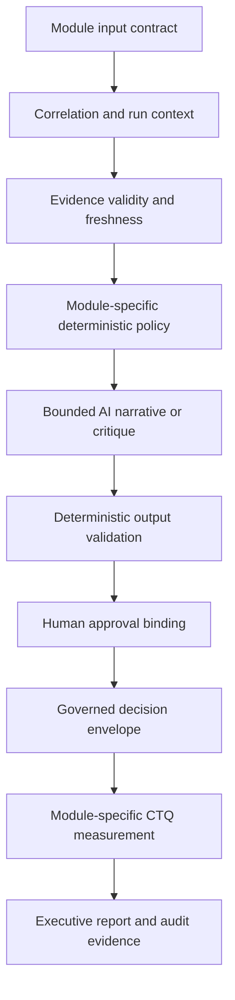

# Architecture

## Decision architecture



## MECE issue tree

```text
Question: Can customer-outcome decisions use one governed pattern without mixing domain policy?
├── Is the evidence decision-ready?
│   ├── Is the input contract complete?
│   ├── Is evidence current and attributable?
│   └── Is contradictory evidence surfaced?
├── Is the decision controlled?
│   ├── Are deterministic rules authoritative?
│   ├── Are AI outputs bounded and validated?
│   └── Is consequential action human-authorised?
└── Is the outcome auditable?
    ├── Is the decision bound to correlation and run IDs?
    ├── Is the module denominator independent?
    └── Can each claim trace to an artifact?
```

## Shared governed controls

Shared implementation patterns include correlation context, input validation, evidence provenance and freshness, AI-output validation, human-approval binding, decision envelopes, audit logging and report generation.

## Module boundaries

| Module | Domain policy retained | Measurement boundary |
|---|---|---|
| Commitment Assurance | Promise structure, acceptance evidence, SLA, closure eligibility | Commitment Assurance only |
| Service Recovery | Technical restoration, relationship recovery, SLA, recurrence | Service Recovery only |
| Customer Momentum | Change detection, hypotheses, intervention, outcome, relapse | Customer Momentum only |

No cross-module DPMO, Sigma level or capability index is asserted.

## Deployment boundary

All public workflow exports are inactive and sanitized. They are Portfolio Preview artifacts and are not configured for production credentials or live writes.
