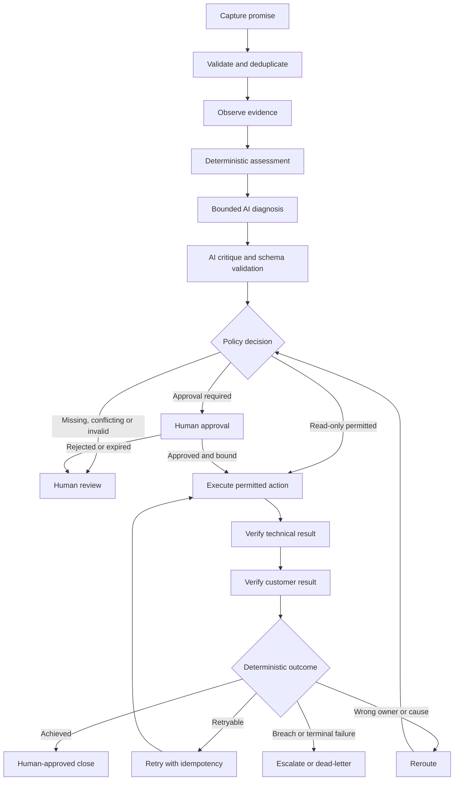
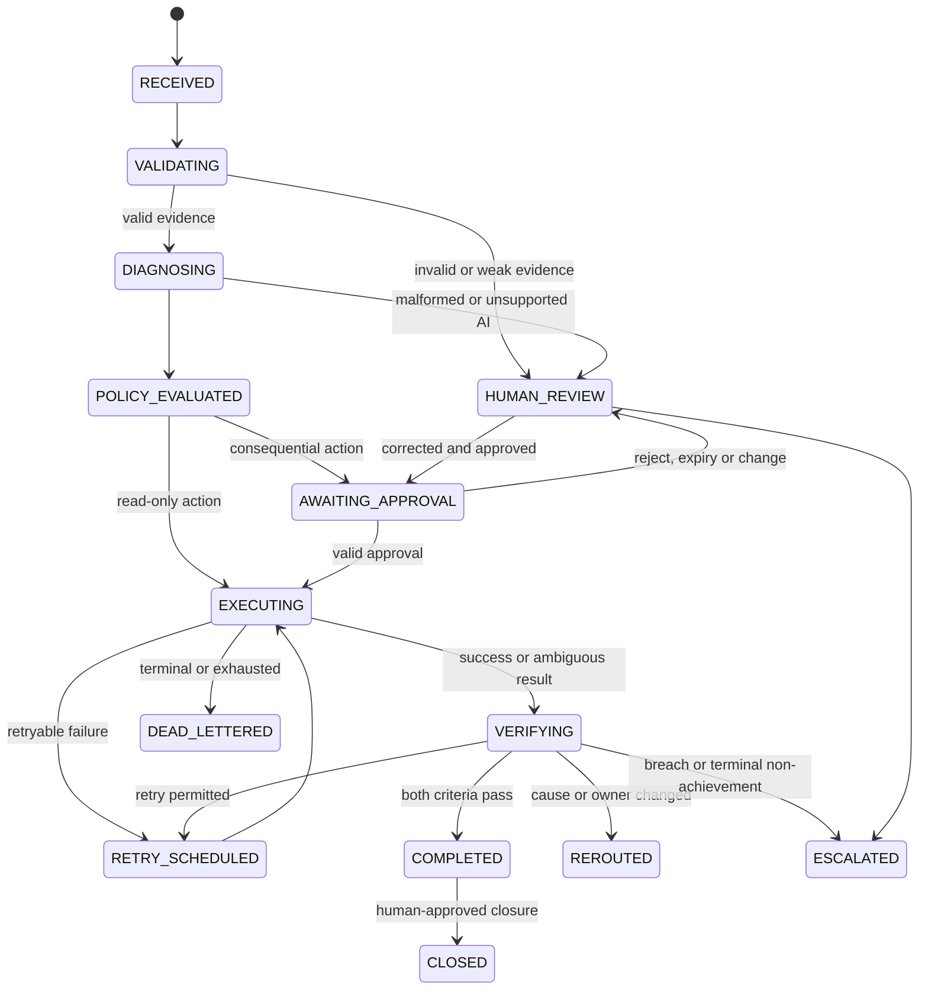

# Vantix Control Value Logical Architecture

## Why this architecture

The central architectural rule is that **AI may interpret evidence, but deterministic controls decide whether the system is allowed to act or claim an outcome**.

This prevents four common failures:

1. an AI-generated narrative becoming “evidence”;
2. a model selecting an action the organization never approved;
3. an approved action being replayed after its payload changes; and
4. a technical change being mistaken for a verified customer outcome.

## Governed agentic loop

The loop is agentic because the system observes, chooses from bounded actions, obtains authority, executes, evaluates the environment again, and selects a governed next state. A second AI call by itself is not the agentic behavior.

## Component model

| Layer | Component | Responsibility | May not do |
| --- | --- | --- | --- |
| Intake | Promise Capture | Accept canonical promise and source identity | Create duplicate logical promises |
| Control | Run Context | Create correlation ID, version set and immutable run metadata | Store credentials or raw tokens |
| Control | Contract Validator | Validate every stage against its schema | Repair evidence silently |
| Control | Duplicate Guard | Check promise and action idempotency keys | Treat a timeout as proof of failure |
| Evidence | Evidence Collector | Read fixture or approved Salesforce evidence | Turn an AI statement into factual evidence |
| Control | Deterministic Assessment | Calculate completeness, strength, likelihood, impact, priority and SLA | Estimate effort or churn |
| Intelligence | Diagnosis Agent | Interpret qualitative context and cite evidence | Calculate official scores or invent action codes |
| Intelligence | Critique Agent | Check cited support, contradictions and internal consistency | Approve action or claim independent validation |
| Control | Policy Engine | Allow, require approval, deny or defer a catalogue action | Accept uncatalogued actions |
| Human control | Approval Gate | Bind a named decision to action ID and payload hash | Accept an AI/system as approver |
| Execution | Action Adapter | Execute read-only, draft, simulated or later sandbox-safe action | Perform disabled live configuration changes |
| Verification | Technical Verifier | Confirm Salesforce-side restoration evidence | Claim the customer used the report |
| Verification | Customer Verifier | Record authorized customer-use attestation | Infer success from technical status |
| Control | Outcome Evaluator | Decide close, retry, reroute, escalate or review | Close without all required evidence |
| Resilience | Retry / Dead Letter | Apply bounded retry and preserve terminal failures | Blindly repeat ambiguous consequential actions |
| Audit | Audit Ledger | Record ordered, append-only events | Store secrets or unredacted sensitive payloads |
| Reporting | Executive Report Builder | Render only validated envelope data | Recalculate or embellish outcomes |

## State machine

## Trust boundaries

| Boundary | Data crossing | Control |
| --- | --- | --- |
| Fixture/Salesforce → n8n | Promise and evidence | Least privilege, allowlisted fields, schema validation, synthetic label |
| n8n → Gemini | Minimal evidence summaries | No secrets/tokens, evidence IDs retained, prompt injection-resistant instructions |
| Gemini → n8n | Diagnosis and critique JSON | Structured-output mode, strict schema, evidence-reference resolution, action-catalogue check |
| n8n → Human | Approval request | Exact action summary, payload hash, evidence, expiry and consequence level |
| Human → n8n | Decision | Named human actor, role authorization, single-use decision, immutable scope |
| n8n → Executor | Approved action | Policy check repeated immediately before execution, idempotency lookup |
| Executor → Verification | Result and new observation | Execution result is not outcome proof; separate verification evidence required |
| n8n → Public report | Sanitized validated envelope | HTML escaping, synthetic banner, no environment identifiers or credentials |

## Logical data stores

### Promise Run Store

- `correlation_id` — unique immutable run key.
- `promise_id` — stable business promise identifier.
- `account_key` — stable account reference.
- `execution_status` — current state.
- `envelope_version` — schema version.
- `envelope_json` — validated canonical payload.
- `created_at`, `updated_at`, `completed_at`.

### Idempotency & Action Ledger

- `idempotency_key` — unique key.
- `promise_id`, `action_id`, `action_code`.
- `payload_hash`.
- `approval_decision_id`.
- `execution_status`.
- `first_seen_at`, `last_seen_at`.

### Audit Event Ledger

- `correlation_id`, `sequence`, `event_id`.
- `event_type`, `actor_type`, `actor_id`.
- `object_type`, `object_id`.
- `result`, `occurred_at`.
- `event_json`.

### Dead-Letter Queue

- `dead_letter_id`, `correlation_id`, `promise_id`, `action_id`.
- `failure_class`.
- `sanitized_error_json`.
- `retry_exhausted`.
- `recovery_owner_role`.
- `created_at`, `resolved_at`.

These are logical schemas only. Physical n8n Data Tables are intentionally deferred until the workflow build so they are designed around Vantix Control Value requirements and not copied from the prior project.

## Duplicate protection

### Promise idempotency

The workflow derives a deterministic key from:

`source system | source record type | source record key | normalized promise statement | due timestamp`

The canonical implementation will store a SHA-256 digest, never the raw concatenated string. A matching successful or active key returns `BLOCKED_DUPLICATE` and links to the existing promise.

### Action idempotency

The workflow derives a deterministic key from:

`promise ID | action code | action payload version | target key`

Before any retry, the executor checks both the ledger and the target state. An ambiguous timeout never triggers a blind consequential retry.

## Retry and failure policy

| Failure class | Example | Default behavior |
| --- | --- | --- |
| Transient read failure | HTTP 429, temporary 5xx | Maximum 3 attempts with bounded backoff |
| Model timeout/unavailable | No structured response | Maximum 3 attempts, then Human Review |
| Schema/semantic failure | Invalid enum, unknown evidence reference | No retry; Human Review |
| Policy denial | Unknown/disabled action | No retry; deny and audit |
| Rejected/expired approval | Human rejects or TTL expires | No execution; Human Review or reroute |
| Consequential-action ambiguous timeout | Connection lost after request | Check idempotency and target state; human review before re-execution |
| Non-retryable execution failure | Authorization denied, invalid target | Dead-letter and assign recovery owner |
| Retry exhausted | Repeated transient failure | Dead-letter and escalate |

Recommended foundation defaults:

- Read/model timeout: 30 seconds per attempt.
- Read/model retries: 3 total attempts.
- Backoff: 2 seconds, 10 seconds, 30 seconds.
- Approval TTL: 24 hours.
- Action approval is single-use.
- Customer communication has no automatic ambiguous retry.

## Deployment boundaries

### Foundation and first validation

- Local/imported n8n workflow.
- Synthetic fixture only.
- Synthetic executor only.
- Separate error-handler workflow for terminal errors and dead-letter recording.

### Optional sandbox validation

- Salesforce OAuth Client Credentials.
- Dedicated API-only integration user.
- Explicit field allowlist.
- Synthetic Salesforce records only.
- Read-only evidence queries.

### Future, not approved by this gate

- Live Salesforce writes.
- Direct access/permission/configuration changes.
- Production customer data.
- Customer communication connector.
- AgileOps creation.
- Commercial SaaS/multi-tenancy.

